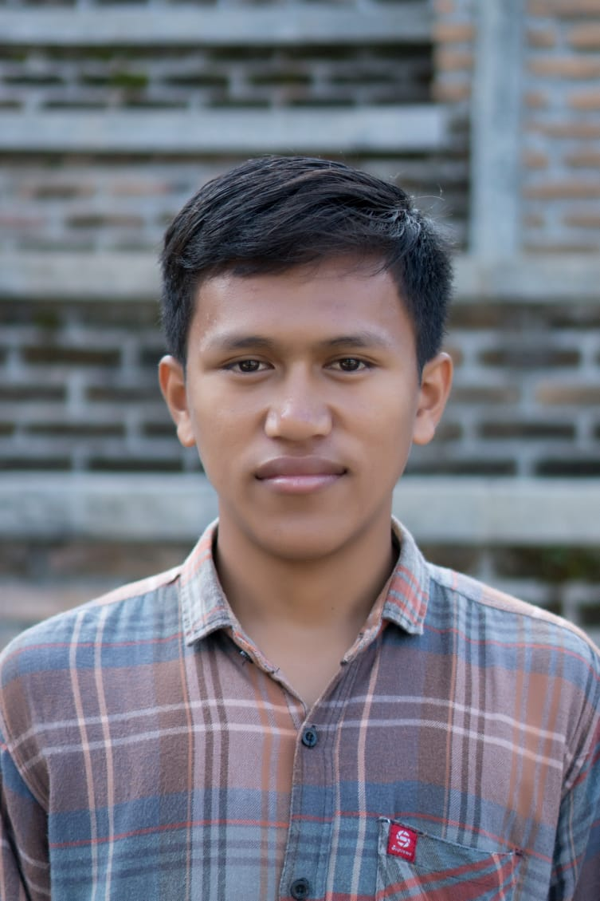

# RW Android Bootcamp
Thanks for [raywanderlich.com](raywenderlich.com) that has chosen me to be a student/participant for this Bootcamp.

## Profile
 

* **Name**: Amzesmoro Sianturi
* **Discord Username**: TM Amzesmoro Sianturi
* **Location**: Siborongborong North Sumatra, Indonesia

Right now, I am an informatics student currently in last semester. I live near Toba Lake and my college is Del Institute of Technology.During college, I have studied several courses that are relevant to my major such as Programming,  Discrete Mathematics, Algorithms & Data Structures, Database, Geometry & Algebra, Algorithm Strategies, Operating Systems, Object-Oriented Programming (OOP) and the others. At the time of lecture, I already knew several programming languages such as C/C++, Java, Python, but I only knew a few of them. Thus I want to decide on a programming language like Kotlin, because I want to become an Android Developer. In my spare time, I often use my cellphone to open Instagram or YouTube and also interest to watching movies, listening to music and reading e-news.
For your information, at this time, my English is not very good, if there are errors in grammar, please understand. :v: :v:
